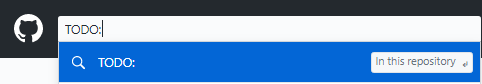

# Instructor Tips

> Tips for using a GitHub repository as a test-bank.

1. Use the repository **exclusively** as a **test-bank**. Do not include other course-related materials such as term-specific items (calendars, course outline, etc.) or demos.
1. Organize your folders in a way that makes it easy to identify and navigate to your resources.
1. Include `ReadMe.md` files in all your significant folders with markdown-links to your test-bank resources.
1. Use a [*template repository*](https://github.com/DMIT-2018/Starter-Kit-TEMPLATE) for creating minimal starter kits for assessments/quizzes/labs.
    - Include a standard `ReadMe.md` along with the `.gitignore` and `.gitattributes` files
    - Set it as a [Template Repository](https://help.github.com/en/github/creating-cloning-and-archiving-repositories/creating-a-template-repository) for use as a basis in creating other repositories
    - [Archive the repository](https://help.github.com/en/github/creating-cloning-and-archiving-repositories/archiving-repositories) to prevent accidental commits to the base template (it can be un-archived later if you need to make changes)
1. Create starter-kit projects in this repo that can be quickly dragged/dropped into a starter-kit repository
    - Use a standard naming convention for your starter-kit repositories, such as **Starter-Kit-*Year-Term-Type-Number***. For example, `Starter-Kit-2019-Sep-InClass-1`
    - Mark the starter-kit as a [**Template Repository**](https://help.github.com/en/github/creating-cloning-and-archiving-repositories/creating-a-template-repository).
    - Use [GitHub Classroom](https://classroom.github.com/) to create assignments with your starter-kits as the assignment template.
1. Include `// TODO: Student Answer Here` comments in the code. This makes searching the test-bank and starter-kit repositories for the student's work easier.
    - 
